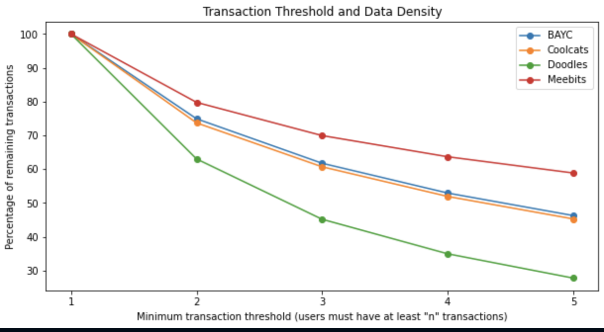
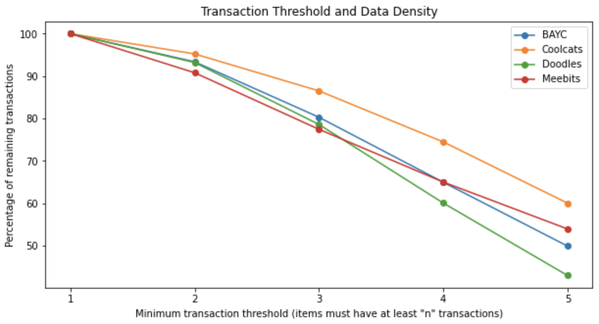
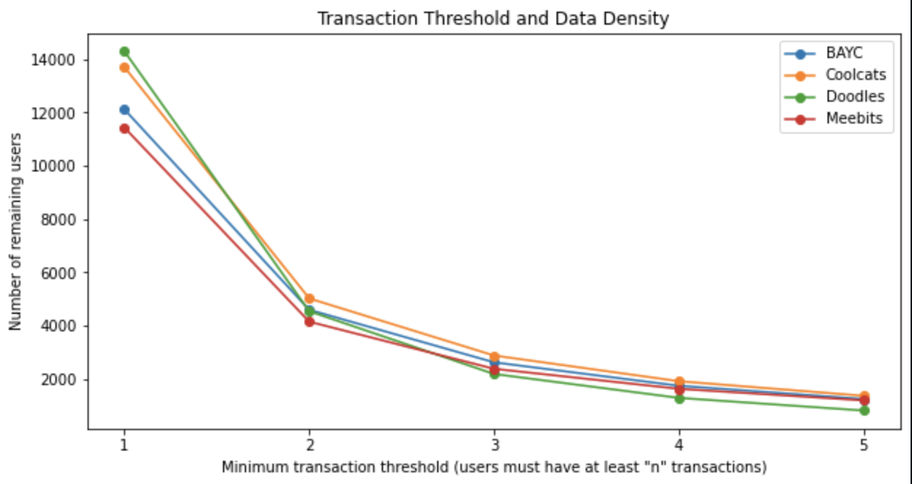
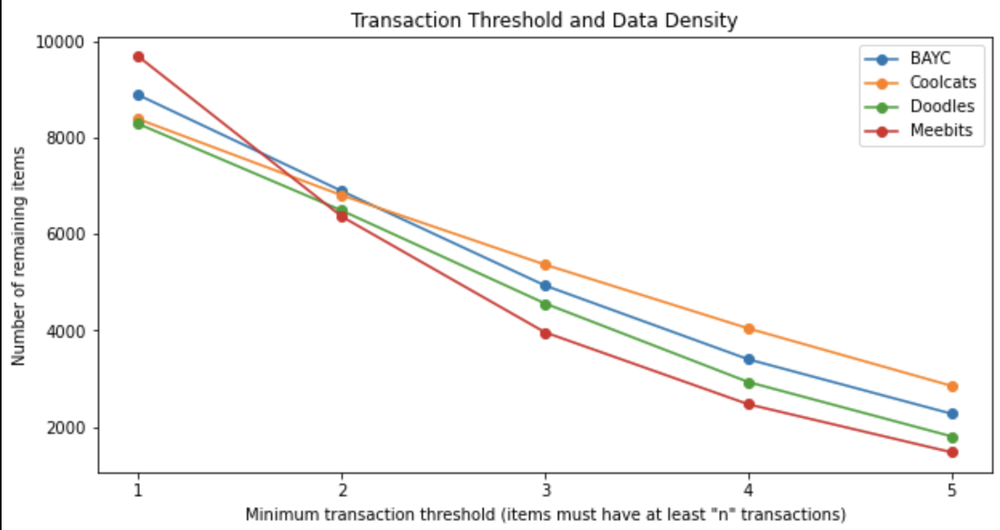

# 1. Data Description

## 1.1. Overview

The number of users, items and interactions for each collection used for the experiment. 
| collection | users | items | interactions |
|-------|------|------|-------------|
| BAYC  | 1230 | 6726 | 13737 |
| Coolcats | 1357 | 6824 | 14890 |
| Doodles | 804 | 4771 | 7250 |
| Meebits | 1184 | 6693 | 21104 |
 

## 1.2. Evaluating Data Density and Transaction Thresholds

We explore our dataset by evaluating its data density and transaction thresholds as determining the optimal transaction threshold is one of the critical steps in designing effective recommender systems. Below analyses were done with complete set of transactions. 

 

- **Number of transaction left after transaction threshold on users**

    
    

 
 

- **Number of transactions left after transaction threshold on items**

    
    

 
 

- **Number of users left after user threshold**

    
    

 
 

- **Number of items left after item threshold**

    

 
    

## 1.3. Power law distribution (coefficient 추가할 것, 배열 다시 정리하기)

Power law distributions provide insights into the relative popularity and concentration of tokens in a dataset. To better understand our dataset, we analyze its power law distribution and compare it with that of a benchmark dataset. This comparison helps us understand how closely our dataset aligns with standard expectations, and if there are any unique characteristics. To ensure a fair comparison, we select a random sample of 36,000 interactions from the benchmark dataset, which matches the number of interactions in our dataset.  
 
1. Our dataset
- Bored Apes Yacht Club  
  
 

- Cool cats 

 

- Doodles 

 

- Meebits 

 

2. Benchmark datasets 
 

- Amazon 

 

- MovieLens20M 

 

The distribution for our datasets shows a weaker power law distribution compared to a benchmark dataset, suggesting that the popularity of items in our dataset is more evenly distributed. This could potentially make the task of recommendation more challenging if relying solely on the collaborative filtering method. In a context where popularity serves as a straightforward and effective indicator for recommendations, it becomes less informative in our dataset due to this more evenly distributed popularity. 
 

## 1.4. Token price movement

In order to incorporate price movement labels (binary: 1 for upward movement, 0 for downward movement) for multi-task learning, we have conducted an examination of the price movements for each token. The columns in the table represent the following: the number of tokens for which the latest transaction price is greater than the initial transaction price, the number of tokens for which the latest transaction price is greater than the mean of the remaining transaction prices (excluding the last one), and the number of tokens for which the mean of the second half of the transaction prices is greater than the mean of the first half of the transaction prices. In the table, each row represents a specific token, and the values indicate the percentage of tokens that exhibit the respective price movements. 

 

| Token      | Latest Price > First Price | Latest Price >Avg. Price (Excluding Last) | Avg. Price (First Half) < Avg. Price (Last Half) |
|------------|-------------------------------|--------------|--------------|
| BAYC       | 59%                         | 61%       | 59% |
| Cool Cats  | 47%                         | 47%         | 50% |
| Doodles    | 58%                          | 48%        | 59% |
| Meebits    | 45%                          | 45%         |47% | 

  

# 2. Side information preparation

## 2.1. Item features
### Image
We employ Convolutional Auto-Encoder(CAE) to get representations from the NFT images. We standardise all images to a shape of `128 * 128 * 3`, where 3 represents the RGB colour spectrum. CAE model consists of an encoder and a decoder, both comprising of eight fully connected alyers, The encoder utilises a 33 convolutional kernel and 22 max pooling, while the decode employs a 33 convolutional kernel along with 22 upsampling.
All non-linear functions in the model are implemented using the ReLU activation function. The model is trained for 100 epochs, with the objective of minimising the Mean Squared Error (MSE) loss. The final image embeddings are obtained by employing only the encoder of the CAE, which reduces the data down to `8 * 8 * 1`
 size. After flattening the output, we receive a 64-dimension representation for each image. This refined data is them ready for subsequent modeling stages. 
 
### Text
The text data for each item is comprised of discrete words each describing each of the visual properties like ‘Background colour’, ‘body’, ‘outfit’, and ‘hair’. Items within the same collection share the same types of visual properties whereas they tend to vary across collections. Cool cats, for example, is a collection of blue cat avatars with each artwork possessing a unique body, hat, face, and outfit, whereas Bored Ape Yacht Club is a collection of monkey avatars having a slightly different types of properties like ‘fur’. Among all, we only have considered six types of properties with the fewest missing values for each collection apart from Cool cats, for which we considered all available 5 types of properties for generating item embeddings. We then processed each descriptive word into a 300-dimension word embedding. This was done by fetching the corresponding embeddings from a pre-trained Word2Vec model. If a particular word was not found in this model, we filled it with zero padding. It's worth noting that while a majority of visual attributes were described by a single word, those composed of multiplie words, like 'short red hair' for 'Hair', we used the sum of each word's embeddings instead. Each word embedding was concatenated with other embeddings related to the same item. As a result, each item's word embedding size ranged from 1500 to 1800, depending on the number of visual traits considered. 
 
### Price, Transaction
Unlike content features, obtained representations from transaction features do not
have sufficient embedding size since there is one average value per each item. So we duplicated the same value to have 64 dimensions. 
 

## 2.2. User features
### Price
The average purchase price of each user was used to represent the user’s financial capability and willingness to pay for NFTs, calculated in the same manner as the price feature of items. 
 

### Transaction frequency
The user’s average holding period for purchased tokens can provide insight into the
user’s trading behavior. This feature was calculated in the same manner as the transaction feature of items. 
 

### Transaction count
We use each wallet address’s transaction count to represent how active the user is in the
NFT market. 

 

## 2.3. Price movement label
We generate price movement label to represent the change in the price of a token between two transactions. The purpose of this feature is to classify whether the price of a token is going to increase or not in the next transaction. We calculate the price difference of each token between the current and subsequent transaction and label it 1 for upward movement, 0 for downward movement or any instances where no subsequent transactions are available for comparison. This kind of information can be valuable in predicting user behavior, as users may behave differently based on whether they anticipate a price increase. 

